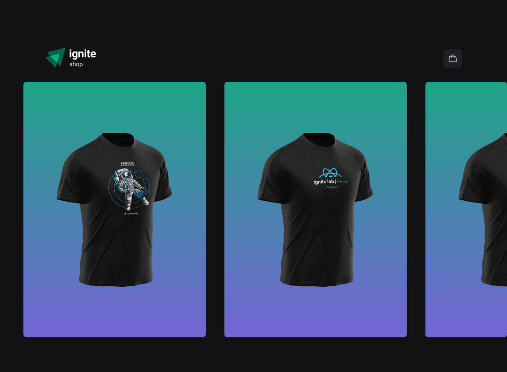
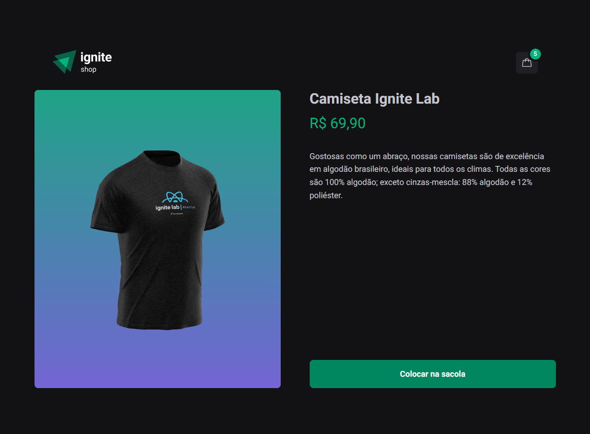
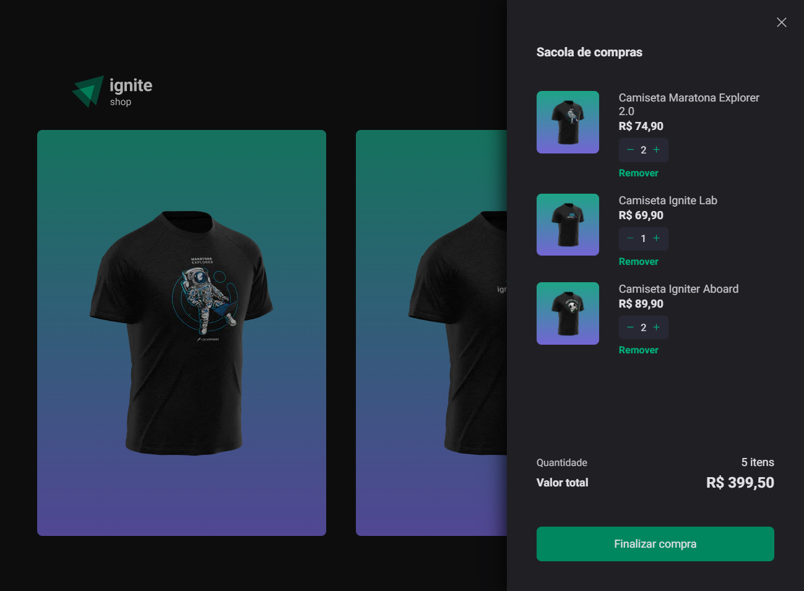
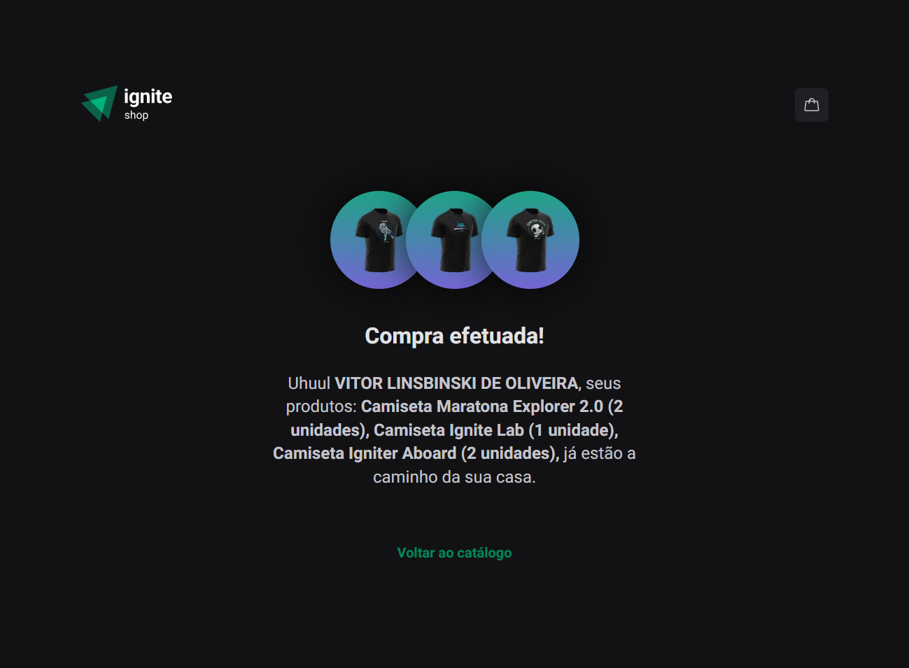

<div align="center">
  
</div>

<h1 align = "center">Ignite Shop</h1>
<p>A project simulating an e-commerce that sells Rocketseat's T-Shirts. This project is using NextJS with TypeScript.</p>
<p>The main purpose of this project is to learn the principles of NextJS Front-End Framework, such as SSR (Server Side Rendering), SSG (Static Site Generating), web performance, routing by directories, and how this tool helps us developers to make pages trackable for browsers bots aiming to improve the SEO.</p>

<div align="center">
  <div style="display: flex; justify-content: space-between; align-items: center;">
    
    
    
    
  </div>
</div>

<h4 align="center"> 
	Ignite Shop | Status: Done ✔️
</h4>

## Table of Contents

- [Features](#features)
- [Requirements to run the project](#requirements-to-run-the-project)
- [Running the application](#running-the-application)
- [Main Technologies](#main-technologies)
- [Final Result](#final-result)
  - [Home page](#home-page)
  - [Product Page](#product-page)
  - [Cart Modal](#cart-modal)
  - [Loading Status](#loading-status)
  - [Success page](#success-page)
- [Deploy](#deploy)
- [License](#license)
- [Author](#author)
- [Contributing Guidelines](#contributing-guidelines)

## Features

Ignite Shop is an e-commerce developed to study NextJS. The main concepts learned are how this framework builds static pages with "getStaticProps", which is a function called by the internal NodeJS server during build time, as well as web optimization.

### 1. Add product to cart

You can add as many products as you want to the cart by clicking on the button with the bag icon or on the product page.

### 2. View product details in product page

When you click on any product on the home page, you are transferred to the product page, which includes the name, description, and price of the shirt. On this page, NextJS catches dynamically the product ID in the URL. With this in hand, a call is made for Stripe API by the "getStaticProps" function, generating static versions of the page and recreating it every two hours.

### 3. Delete product from cart

By opening the cart modal, you can browse the products you added to buy. On there, you can delete any product you want.

### 4. Add more ou less product quantity

In the cart modal, there is a product counter where you can increase or decrease the number of shirts of the same type.

### 6. Checkout

When you check out, you are redirected to the Stripe checkout page, where you enter personal and purchase information. Considering this as a test mode, you can add a fake credit card number such as “4242 4242 4242 4242”.

### 7. Success page

If the purchase information is correct and there's nothing wrong with it, you are redirected to the success page, where you can find a brief of your purchase.

## Requirements to run the project

<p>Before you run the project, check if you have [Node.js](https://nodejs.org/en/) installed on your machine, as well [Git](https://git-scm.com) to clone this repository.</p>

## Running the application

<p>Before you run the application, read the docs of Stripe Library and create an account to proceed with this project.</p>

```bash
    # Clone this repository on your machine:
    $ git clone https://github.com/vitorlinsbinski/ignite-shop.git

    # Access the project folder in your terminal:
    $ cd ignite-shop

    # Install all dependencies:
    $ npm install

    # Run the application:
    $ npm run dev
```

<p>After this, go to "developers" and generate the public and the private API keys. Then, put these API keys in the format of environment variables, creating a file called ".env.local" in the project root folder, containing "PUBLIC_KEY" and "STRIPE_SECRET_KEY". Additionally, you must create a variable called "NEXT_URL", which receives the URL where the project is hosted, that is, on localhost in development mode. </p>

<p>So, create products on the Stripe page containing name, description, image, and price.</p>

## Main Technologies

- [ReactJS](https://react.dev/)
- [NextJS](https://nextjs.org/)
- [TypeScript](https://www.typescriptlang.org/)
- [React Router DOM](https://reactrouter.com/en/main)
- [Axios](https://axios-http.com/ptbr/docs/intro)
- [Stitches](https://stitches.dev/)
- [Radix UI](https://www.radix-ui.com/)
- [Stripe API](https://stripe.com/)
- [Phosphor React](https://www.npmjs.com/package/phosphor-react)
- [Keen Slider](https://keen-slider.io/)

## Final Result

### Home page

<span>/</span>


### Product Page

<span>/product/[id]</span>


### Cart Modal

<span>/</span>


### Loading Status

<span>/</span>


### Success page

<span>/success/[success_id]</span>


## Deploy

Check out the project working: https://ignite-shop-beta.vercel.app/

## Contributing Guidelines

Contributions are welcome! Whether you want to fix a bug, add a new feature, or improve documentation, your contributions are valuable.

### 1. Fork the Repository

Click the "Fork" button at the top right of this repository to create a copy in your GitHub account.

### 2. Clone the Repository

Clone your forked repository to your local machine using the following command:

```bash
git clone https://github.com/your-username/ignite-shop.git
```

### 3. Create a Branch

Create a new branch for your contribution:

```bash
git checkout -b feature/your-feature-name
```

### 4. Make changes

Make your desired changes to the codebase. Ensure that your code is working well without problems or bugs.

### 5. Test your changes

Before submitting a pull request, test your changes thoroughly to ensure they work as expected.

### 6. Commit and Push

Commit your changes and push them to your forked repository:

```bash
git add .
git commit -m "Add your descriptive commit message here"
git push origin feature/your-feature-name
```

## License

This project is licensed under [MIT](https://choosealicense.com/licenses/mit/) License.

### Author

<a href="https://github.com/vitorlinsbinski">
 
 <br />
 <sub><b>Vitor Linsbinski</b></sub></a> <a href="https://github.com/vitorlinsbinski" title="">🚀</a>

Developed by Vitor Linsbinski

[](https://www.linkedin.com/in/vitorlinsbinski/)
